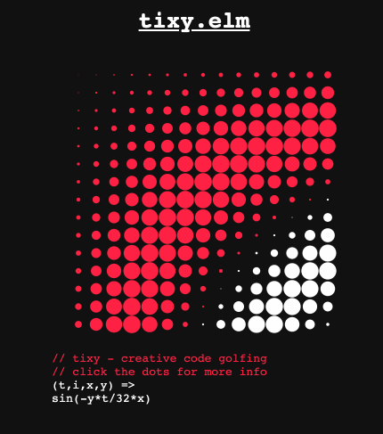

# Tixy.elm

An implementation of [tixy.land](https://tixy.land) in
[elm](https://elm-lang.org).

You can play with it here: [tixy.juliu.is](https://tixy.juliu.is)

You can save your creation and share it as a link, such as this one:

https://tixy.juliu.is/?code=sin(-y*t%2F32*x)

Have fun!

## Credits

- [@aemkei](https://twitter.com/aemkei) for the original tixy.land
- [@DeedoDev](https://twitter.com/DeedoDev) for the Elm prototype

## License

The repo is provided under the [MIT License](LICENSE).
